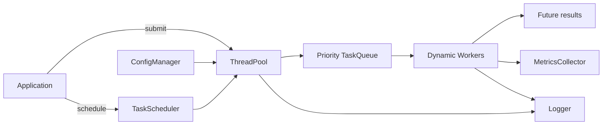

# cpp-thread-pool-lib

[](https://github.com/chaudhary0101/cpp-thread-pool-lib/actions/workflows/ci.yml)
[](https://isocpp.org/)
[](LICENSE)
[](#platform-support)

A reusable, production-style C++17 thread pool for Linux and UNIX-oriented
applications. It combines prioritized task execution, futures, dynamic workers,
delayed and periodic scheduling, graceful shutdown, structured logging, runtime
metrics, configuration, tests, and CI in a dependency-light library.

## Problem statement

Creating a new thread for each unit of work wastes resources and makes lifecycle,
error handling, prioritization, and observability difficult. This library keeps a
managed set of reusable workers behind a synchronized queue and exposes one
consistent API for immediate and scheduled work.

## Features

- Dynamically grow or shrink the worker set at runtime
- Four task priorities with FIFO ordering inside each priority
- Type-safe `std::future` results and exception propagation
- Delayed one-shot and fixed-delay periodic tasks
- Cooperative cancellation for scheduled tasks
- Graceful draining of accepted immediate work
- Thread-safe logging with level and file controls
- Atomic throughput, failure, latency, queue, worker, and uptime metrics
- Dependency-free `key=value` configuration parser
- RAII ownership and idempotent shutdown
- CMake install/export support for downstream projects
- Google Test unit and integration coverage
- GCC/Clang CI, clang-format, clang-tidy, and Valgrind

## Architecture



The scheduler performs timing only; due work follows the same priority queue as
immediate work. Workers never own queued tasks beyond the one currently executing.
See [docs/architecture.md](docs/architecture.md) for sequence and shutdown diagrams.

## Repository layout

```text
cpp-thread-pool-lib/
├── .github/workflows/ci.yml
├── cmake/cpp_thread_pool_config.cmake.in
├── configs/thread_pool.conf
├── docs/
│   ├── architecture.md
│   ├── design_decisions.md
│   ├── git_history.md
│   ├── performance.md
│   ├── repository_metadata.md
│   └── troubleshooting.md
├── examples/
│   ├── basic_usage.cpp
│   ├── benchmark.cpp
│   └── scheduled_tasks.cpp
├── include/cpp_thread_pool/
│   ├── config_manager.hpp
│   ├── logger.hpp
│   ├── metrics_collector.hpp
│   ├── task_queue.hpp
│   ├── task_scheduler.hpp
│   ├── thread_pool.hpp
│   ├── types.hpp
│   ├── version.hpp
│   └── worker.hpp
├── scripts/
│   ├── build.sh
│   ├── run_coverage.sh
│   └── run_valgrind.sh
├── src/
├── tests/
├── CMakeLists.txt
├── CHANGELOG.md
├── CONTRIBUTING.md
├── LICENSE
├── README.md
└── SECURITY.md
```

## Requirements

- Linux or another platform with C++17 `std::thread` support
- CMake 3.16 or newer
- GCC 9+ or Clang 10+
- Internet access during the first test configuration, unless Google Test is cached

## Build and test

```bash
git clone https://github.com/chaudhary0101/cpp-thread-pool-lib.git
cd cpp-thread-pool-lib
cmake -S . -B build -DCMAKE_BUILD_TYPE=Release
cmake --build build --parallel
ctest --test-dir build --output-on-failure
```

Build the library without tests or examples:

```bash
cmake -S . -B build \
  -DCMAKE_BUILD_TYPE=Release \
  -DCPP_THREAD_POOL_BUILD_TESTS=OFF \
  -DCPP_THREAD_POOL_BUILD_EXAMPLES=OFF
cmake --build build --parallel
```

Install it:

```bash
cmake --install build --prefix "$HOME/.local"
```

A downstream CMake project can then use:

```cmake
find_package(cpp_thread_pool 1.0 REQUIRED)
target_link_libraries(my_application PRIVATE cpp_thread_pool::cpp_thread_pool)
```

## Basic usage

```cpp
#include "cpp_thread_pool/thread_pool.hpp"

#include <iostream>

int main() {
    cpp_thread_pool::ThreadPool pool(4);

    auto answer = pool.submit(
        cpp_thread_pool::TaskPriority::high,
        [](int lhs, int rhs) { return lhs + rhs; },
        20,
        22);

    std::cout << answer.get() << '\n';
}
```

## Scheduling

```cpp
using namespace std::chrono_literals;

auto delayed = pool.schedule_after(
    250ms,
    cpp_thread_pool::TaskPriority::normal,
    [] { return "ready"; });

const auto periodic_id = pool.schedule_every(
    1s,
    cpp_thread_pool::TaskPriority::low,
    [] { poll_system_health(); });

consume(delayed.second.get());
pool.cancel_scheduled(periodic_id);
```

Cancellation is cooperative: a task already transferred to the worker queue may run
once. Periodic tasks use fixed-delay scheduling.

## Runtime configuration

```ini
worker_threads=4
log_level=info
log_file=thread_pool.log
```

```cpp
const auto config =
    cpp_thread_pool::ConfigManager::load("configs/thread_pool.conf");
cpp_thread_pool::ThreadPool pool(config);
```

## Metrics

```cpp
const auto stats = pool.statistics();
std::cout << "submitted: " << stats.submitted_tasks << '\n'
          << "completed: " << stats.completed_tasks << '\n'
          << "queued: " << stats.queued_tasks << '\n'
          << "average execution (us): "
          << stats.average_execution_time_us << '\n';
```

Statistics are safe to sample while work is active. They are intended for health
endpoints, diagnostics, benchmark reporting, and operational logs.

## Performance

Build in Release mode and run:

```bash
./build/benchmark 1000000
```

The benchmark reports worker count, elapsed time, throughput, and a deterministic
checksum. Results are intentionally measured on the target host rather than claimed
as universal numbers; CPU topology, compiler, power policy, and task size materially
change throughput. The measurement protocol and Linux `perf` commands are in
[docs/performance.md](docs/performance.md).

## Memory safety

The design uses RAII threads, standard containers, smart pointers, and no raw owning
pointers. Shutdown is idempotent, workers are joined, and queued callable state
remains alive until execution or scheduler destruction.

Run the complete test binary under Valgrind:

```bash
./scripts/run_valgrind.sh
```

The CI treats definite leaks, invalid reads/writes, and origin-tracked memory errors
as failures. ThreadSanitizer instructions are available in
[docs/troubleshooting.md](docs/troubleshooting.md).

## Coverage

Install `gcovr`, then run:

```bash
./scripts/run_coverage.sh
```

The HTML report is written to `coverage/index.html`.

## Debugging with GDB

```bash
cmake -S . -B build-debug -DCMAKE_BUILD_TYPE=Debug
cmake --build build-debug --parallel
gdb --args ./build-debug/cpp_thread_pool_tests
```

Useful breakpoints include
`cpp_thread_pool::ThreadPool::worker_loop`,
`cpp_thread_pool::TaskScheduler::run`, and
`cpp_thread_pool::ThreadPool::shutdown`.

## Platform support

Linux is the primary CI and production target. The implementation uses portable
C++17 threading and also builds on other conforming platforms. Valgrind, `perf`,
shell scripts, and the published operational guidance are Linux-specific.

## Real-world use cases

- Parallel parsing and aggregation of telecom performance samples
- Background processing for automotive infotainment services
- Dispatching IPC or socket-message handlers without per-request threads
- Concurrent file, packet, or telemetry transformation pipelines
- Prioritizing control-plane work over bulk background processing
- Periodic health checks, statistics collection, and housekeeping

## Engineering and resume mapping

| Resume skill | Evidence in this repository |
|---|---|
| C++17, OOP, STL | Templates, RAII, smart pointers, containers, futures |
| Multithreading | Reusable workers, scheduler thread, dynamic resizing |
| Synchronization | Mutexes, condition variables, atomics, queue invariants |
| Linux/UNIX | CMake build, shell automation, Valgrind, perf, CI |
| Performance optimization | Release benchmark, metrics, profiling workflow |
| GDB and Valgrind | Debug symbols, documented breakpoints, CI memory checks |
| Unit testing | Google Test unit and mixed-workload integration suites |
| CMake and Git | Installable target, package export, disciplined commit plan |
| SDLC | Requirements, design decisions, tests, CI, security, troubleshooting |

## Why this project matters to systems recruiters

The repository demonstrates the engineering concerns behind production C++:
ownership, synchronization, lifecycle ordering, failure propagation, performance
measurement, diagnostics, testability, packaging, and Linux toolchain discipline.
It is directly relevant to automotive, telecom, networking, semiconductor, storage,
and platform teams at companies such as KPIT, Harman, Bosch, Qualcomm, Siemens,
Nokia, Cisco, Synopsys, Samsung, Intel, AMD, HPE, and Western Digital.

## Screenshots

Use the output of `basic_usage`, `benchmark`, the GitHub Actions matrix, and the
Valgrind summary as repository screenshots after running them on the target Linux
machine. Keeping screenshots tied to actual runs prevents stale or fabricated
performance evidence.

## License

MIT License. See [LICENSE](LICENSE).
