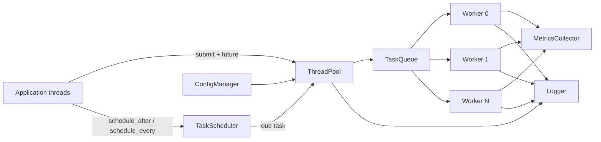
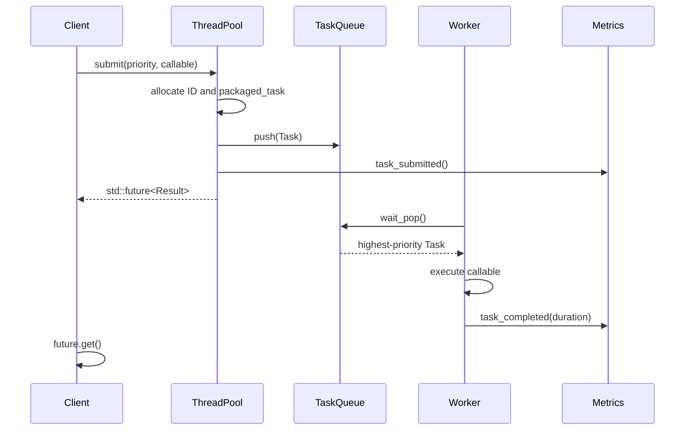

# Architecture

## System context

`cpp-thread-pool-lib` accepts callable objects from application threads and executes
them on a bounded set of reusable workers. Immediate tasks enter a synchronized
priority queue. Delayed and periodic tasks first enter the scheduler, which releases
them into the same execution path when they become due.

## Component responsibilities

### ThreadPool

The public facade owns all runtime components. It allocates task identifiers,
wraps callables in `std::packaged_task`, returns futures, manages worker count, and
coordinates shutdown. The accepting flag prevents new work from racing with
shutdown.

### Worker

Each `Worker` owns one `std::thread`. It runs the pool-provided work loop and is
joined through RAII. Worker identifiers also support cooperative downsizing:
workers whose identifiers are above the desired count leave after their current
task.

### TaskQueue

The queue is a mutex-protected `std::priority_queue` with a condition variable.
Priority is evaluated first; sequence number provides FIFO ordering among tasks
with equal priority. Closing the queue wakes all workers and allows already queued
tasks to drain.

### TaskScheduler

The scheduler owns one timing thread and a min-heap ordered by due time. It sleeps
until the nearest deadline, forwards due work to the pool, and re-enqueues periodic
tasks. Cancellation is cooperative and thread-safe.

### MetricsCollector

Metrics use relaxed atomics because counters do not establish synchronization
between tasks. Snapshots report submitted, completed, failed, rejected, queued,
worker, execution-time, and uptime values.

### Logger

The logger serializes writes, adds timestamps and thread identifiers, supports five
levels, and can target `std::clog` or an append-only file.

### ConfigManager

The parser reads a deliberately small `key=value` format. Invalid syntax, zero
workers, unknown log levels, and inaccessible files fail fast with descriptive
exceptions.

## Submission sequence

## Shutdown sequence

1. Atomically stop accepting new tasks.
2. Stop and join the scheduler so it cannot enqueue more work.
3. Close the task queue and wake all workers.
4. Workers drain queued tasks, observe the closed-and-empty state, and exit.
5. Join every worker thread.

This ordering prevents use-after-destruction and guarantees that accepted immediate
tasks complete before `shutdown()` returns.

